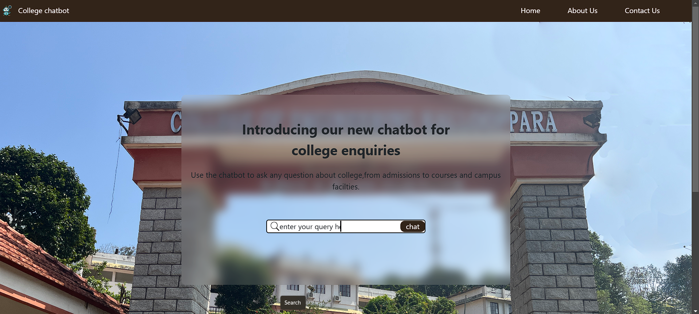
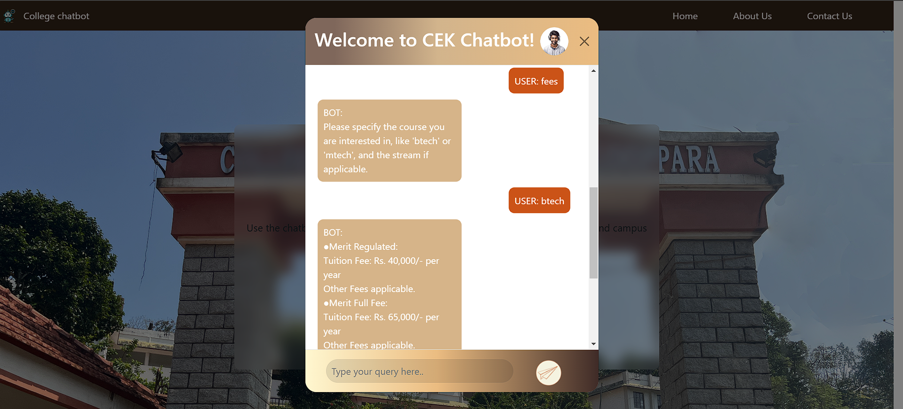
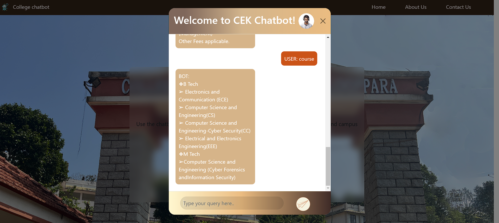

# College Enquiry Chatbot

A chatbot designed to assist users with inquiries about the college, including details about courses, admissions, facilities, and more. The chatbot provides instant responses, improving the user experience for prospective students and parents.

## Features

- **Course Information**: Retrieve detailed information about courses offered.
- **Admission Queries**: Get answers to frequently asked questions about admissions.
- **Facilities Overview**: Learn about the campus facilities, including hostels, libraries, and labs.
- **Interactive Interface**: User-friendly chatbot interface embedded in the homepage.

## Tech Stack

- **Frontend**: HTML, CSS, JavaScript
- **UI Framework**: Bootstrap (used for creating the chatbot modal)

## Data Storage

- Data is stored as JavaScript objects within the codebase, allowing easy retrieval and modification.

## Installation and Usage

1. Clone the repository:
   ```bash
   git clone https://github.com/TinuCM/College-Enquiry-Chatbot.git
   ```
2. Open the `index.html` file in any modern web browser.
3. Interact with the chatbot by clicking on the chatbot window (Bootstrap modal) on the homepage.

## Screenshots


*Screenshot 1: Chatbot Home Page*

*Screenshot 2: Chatbot Interaction*

*Screenshot 3: Fee Details*

*Screenshot 4: Course Details*

## Future Enhancements

- Add a backend for dynamic data handling.
- Integrate natural language processing (NLP) for better conversational responses.
- Enhance the UI for a more modern look.

## Contact

For any queries or issues, please contact:

- **Name**: Tinu C Mathew
- **Email**: [tinucherian229@gmail.com]
- **GitHub**: [https://github.com/TinuCM](https://github.com/TinuCM)
